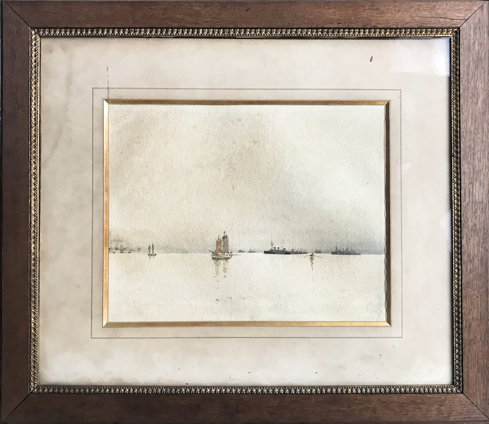
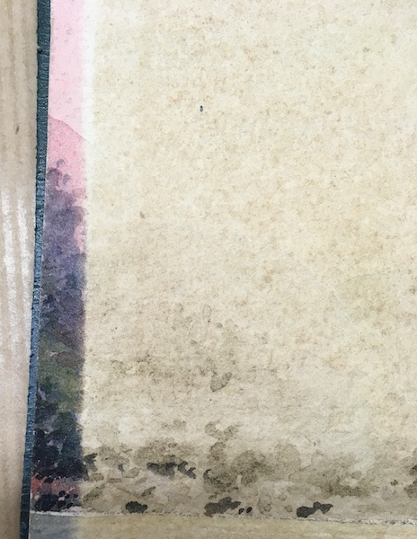

Lors de notre jeunesse en Bretagne, les oncles et tantes nous parlaient de leurs oncles et tantes, surtout du côté Moysan ; tonton Emile et tonton Francis étaient les noms les plus cités.

L'aquarelle et les personnages chinois cités plus loin étaient exposés dans la maison des tantes de Quimperlé. 

Je savais donc que j'avais un grand-oncle officier de marine qui était allé en Extrême-Orient mais sans beaucoup de détails.

Au décès d'Emile Guibourg en 1995, j'ai récupéré des objets se trouvant dans sa maison, notamment les lettres dactylographiées d'Emile Moyan à ses parents.

Puis au décès de Geneviève en 2011, j'ai récupéré l'aquarelle et les personnages chinois.

## Aquarelle
​

​

Cette aquarelle a passé une centaine d'années dans l'escalier de la maison familiale de la rue Savary exposé au rayonnement solaire.

Sachant qu'Émile Moysan était allé en Extrême-Orient, et en voyant les jonques, l'origine de l'aquarelle était évidente. mais c'est en restaurant l'aquarelle que nous avons pu voir les couleurs originales et une forme de relief qui nous a confirmé, avec les lettres d'Asie, qu'elle représente l'escadre française en baie d'Halong.

​
## Personnages chinois

Dans la maison des tantes, une vitrine présentait une quarantaine de figurines chinoises qu'on nous disait être en mie de pain. 

Comme l'aquarelle ils ont dû être achetés en Chine, lors de son passage à Hong Kong.

## Reprise de contact avec la branche Moysan

L'aquarelle a été l'élément déclencheur qui m'a amené à faire des recherches sur la carrière d'Emile Moysan ; j'ai trouvé une biographie résumée sur le site "Parcours de vie dans la Royale".

Cette biographie mentionne son petit-fils François Guibourg, également officier de marine avec lequel j'ai repris contact grâce au webmestre.

François Guibourg m'a fourni de nombreuses informations qui m'ont incité à publier un essai d'histoire de sa vie.

​